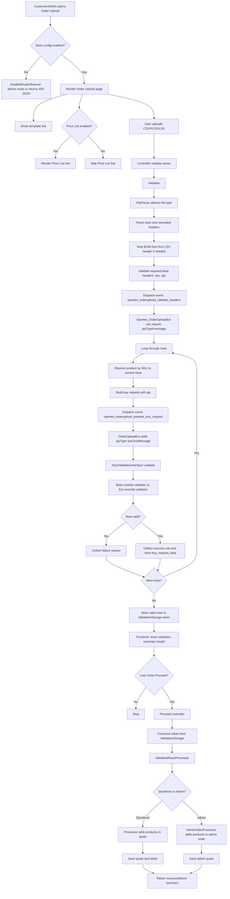

# Order Upload Flow

```mermaid
flowchart TD
    A["Customer/Admin opens Order Upload"] --> B{"Store config enabled?"}
    B -- "No" --> C["DisableRouteObserver blocks route or returns 403 JSON"]
    B -- "Yes" --> D["Render Order Upload page"]

    D --> E["Show template link"]
    D --> F{"Price List enabled?"}
    F -- "Yes" --> G["Render Price List link"]
    F -- "No" --> H["Skip Price List link"]

    D --> I["User uploads CSV/XLS/XLSX"]
    I --> J["Controller validate action"]
    J --> K["Validator"]

    K --> L["FileParser detects file type"]
    L --> M["Parse rows and normalize headers"]
    M --> N["Strip BOM from first CSV header if needed"]
    N --> O["Validate required base headers: sku, qty"]

    O --> P["Dispatch event: oporteo_orderupload_validate_headers"]
    P --> Q["Oporteo_OrderUploadExt can require qtyType/message"]

    Q --> R["Loop through rows"]
    R --> S["Resolve product by SKU in current store"]
    S --> T["Build buy request with qty"]

    T --> U["Dispatch event: oporteo_orderupload_prepare_buy_request"]
    U --> V["OrderUploadExt adds qtyType and lineMessage"]

    V --> W["StockValidatorInterface::validate"]
    W --> X["Base module validator or Ext override validator"]

    X --> Y{"Row valid?"}
    Y -- "No" --> Z["Collect failure reason"]
    Y -- "Yes" --> AA["Collect success row and store buy_request_data"]

    Z --> AB{"More rows?"}
    AA --> AB
    AB -- "Yes" --> R
    AB -- "No" --> AC["Store valid rows in ValidationStorage token"]

    AC --> AD["Frontend: show validation summary modal"]
    AD --> AE{"User clicks Proceed?"}
    AE -- "No" --> AF["Stop"]
    AE -- "Yes" --> AG["Proceed controller"]

    AG --> AH["Consume token from ValidationStorage"]
    AH --> AI["ValidatedRowsProcessor"]

    AI --> AJ{"Storefront or Admin?"}
    AJ -- "Storefront" --> AK["Processor adds products to quote"]
    AJ -- "Admin" --> AL["AdminOrderProcessor adds products to admin order"]

    AK --> AM["Save quote and totals"]
    AL --> AN["Save admin quote"]

    AM --> AO["Return success/failure summary"]
    AN --> AO
```
